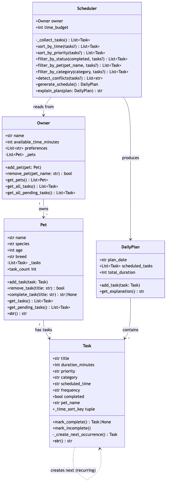

# PawPal+ (Module 2 Project)

**PawPal+** is a Streamlit-powered pet care planning assistant that helps busy pet owners stay on top of daily care routines. It tracks tasks, considers constraints, and produces an optimised daily schedule with clear reasoning.

## Features

| Feature | Description |
|---|---|
| **Owner & Pet profiles** | Register an owner with a time budget and add multiple pets with species, age, and breed |
| **Task management** | Add tasks with duration, priority, category, scheduled time, and frequency |
| **Sort by time** | `sort_by_time()` orders tasks chronologically by `HH:MM`, placing unscheduled tasks last |
| **Sort by priority** | `sort_by_priority()` ranks high → medium → low, breaking ties by shortest duration |
| **Filter by pet / status / category** | Slice the task list on any dimension |
| **Recurring tasks** | Daily and weekly tasks auto-create a new pending occurrence when completed |
| **Conflict detection** | `detect_conflicts()` flags overlapping time windows with clear `st.warning` messages |
| **Smart scheduling** | Greedy algorithm fills a time budget starting with highest-priority, shortest tasks |
| **Plan explanation** | Every schedule includes a breakdown of why tasks were chosen, and which were skipped |
| **Task completion** | Mark tasks complete from the UI; recurring tasks automatically regenerate |

## System Architecture

The final UML class diagram:



The Mermaid source is in [`uml_final.mmd`](uml_final.mmd).

## Getting started

### Setup

```bash
python -m venv .venv
source .venv/bin/activate  # Windows: .venv\Scripts\activate
pip install -r requirements.txt
```

### Run the app

```bash
streamlit run app.py
```

### Suggested workflow

1. Read the scenario carefully and identify requirements and edge cases.
2. Draft a UML diagram (classes, attributes, methods, relationships).
3. Convert UML into Python class stubs (no logic yet).
4. Implement scheduling logic in small increments.
5. Add tests to verify key behaviors.
6. Connect your logic to the Streamlit UI in `app.py`.
7. Refine UML so it matches what you actually built.

## Smarter Scheduling

The Scheduler class includes several algorithmic features beyond simple list management:

- **Sort by time** — `sort_by_time()` orders tasks by their `HH:MM` scheduled time using a lambda key, placing unscheduled tasks at the end.
- **Sort by priority** — `sort_by_priority()` ranks tasks high → medium → low, breaking ties by shortest duration.
- **Filter by pet / status / category** — `filter_by_pet()`, `filter_by_status()`, and `filter_by_category()` let you slice the task list by any dimension.
- **Recurring tasks** — Tasks with `frequency="daily"` or `"weekly"` automatically create a new pending occurrence when marked complete, using `timedelta` for date arithmetic.
- **Conflict detection** — `detect_conflicts()` compares every pair of timed tasks and flags overlapping windows (start-time + duration overlap) with a warning message instead of crashing.

## Testing PawPal+

Run the automated test suite:

```bash
python -m pytest tests/ -v
```

The test suite includes **41 tests** across 8 categories:

| Category | Tests | What it verifies |
|---|---|---|
| Task basics | 3 | Completion, reset, string output |
| Pet management | 6 | Add/remove tasks, pet_name tagging, empty pet, pending filter |
| Owner aggregation | 4 | Multi-pet tasks, no-pets, pending-only, remove pet |
| Sorting | 5 | Chronological order, unscheduled-last, same-hour ties, priority + duration |
| Filtering | 4 | By pet, by status, by category, no-match |
| Recurring tasks | 5 | Daily, weekly, attribute preservation, one-time, double-complete |
| Conflict detection | 5 | Exact overlap, partial overlap, no overlap, cross-pet, unscheduled |
| Schedule edge cases | 9 | Budget, priority, empty/zero/exceeded, all-completed, plan explanation |

**Confidence level: ⭐⭐⭐⭐ (4/5)** — all happy paths and key edge cases are covered.
